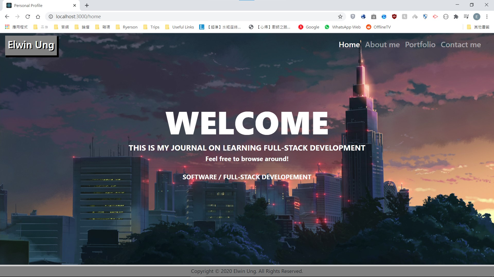
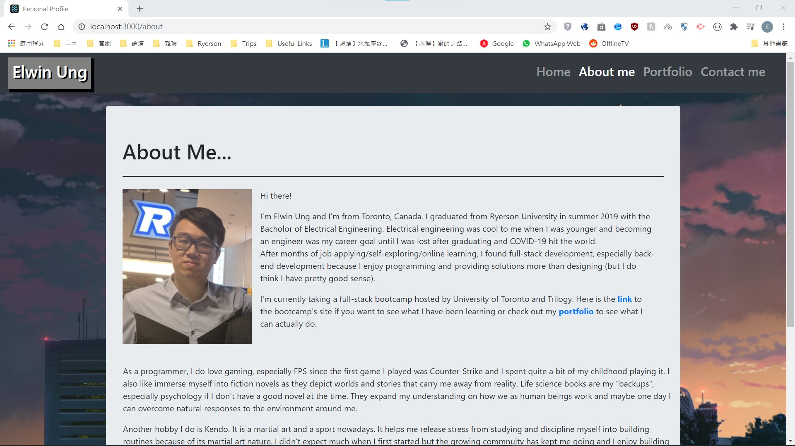
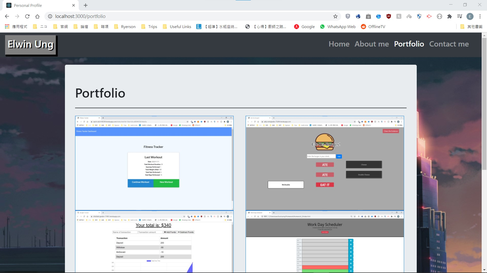
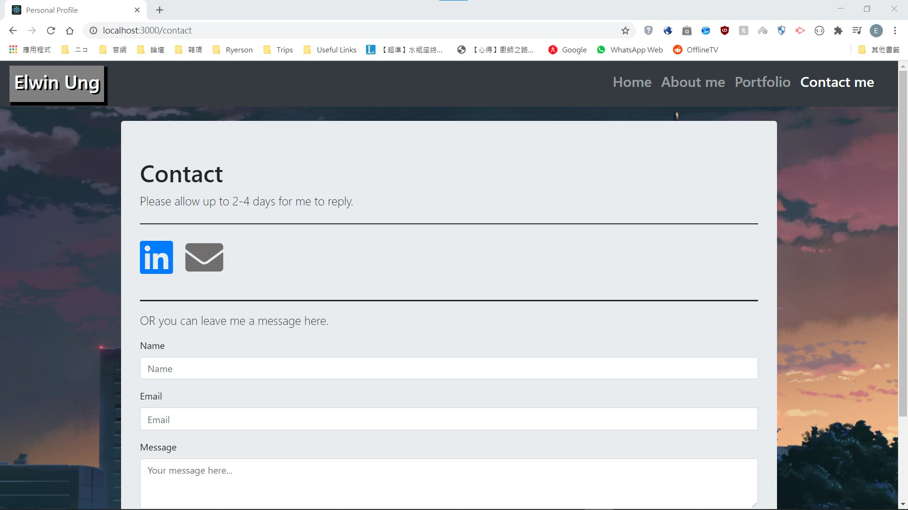

# Personal Profile with React
This my personal profile website hosted on Github Pages:  
It is based on the *WithDatabase* branch.

## What's New?
- The site was rebuilt using the **React** framework
- No more messy page manger scripts for each page as it is included with each component
- No more lengthy HTML files since with **React**, different content can be rendered on the same page based on request

## Future Development
- Make the *Previous* and *Next* buttons on the *Portfolio* page works
- Add **express.js** as back-end

## Overview

